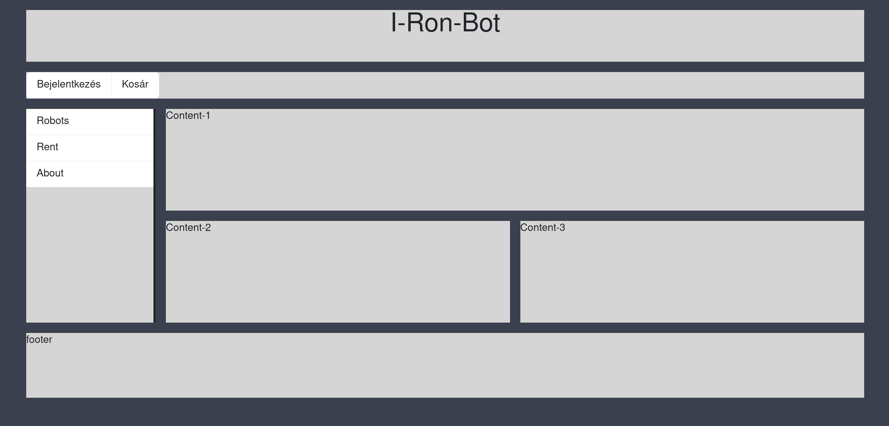
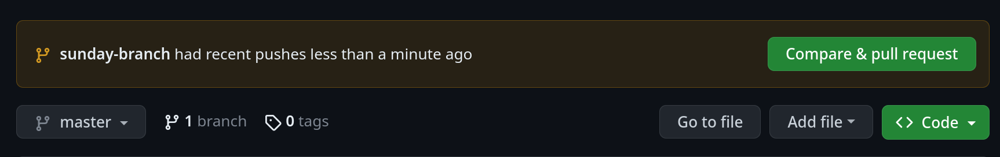
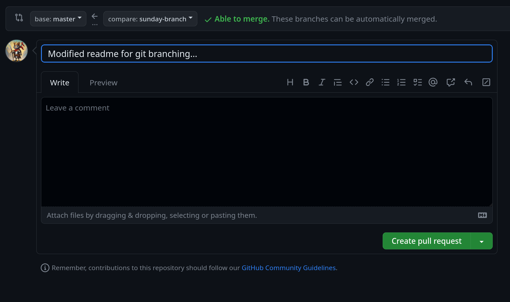
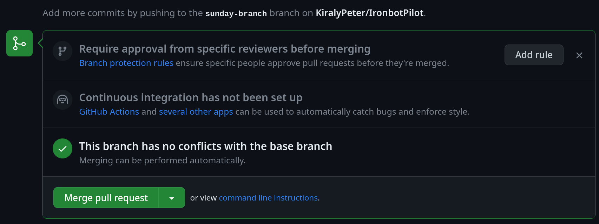
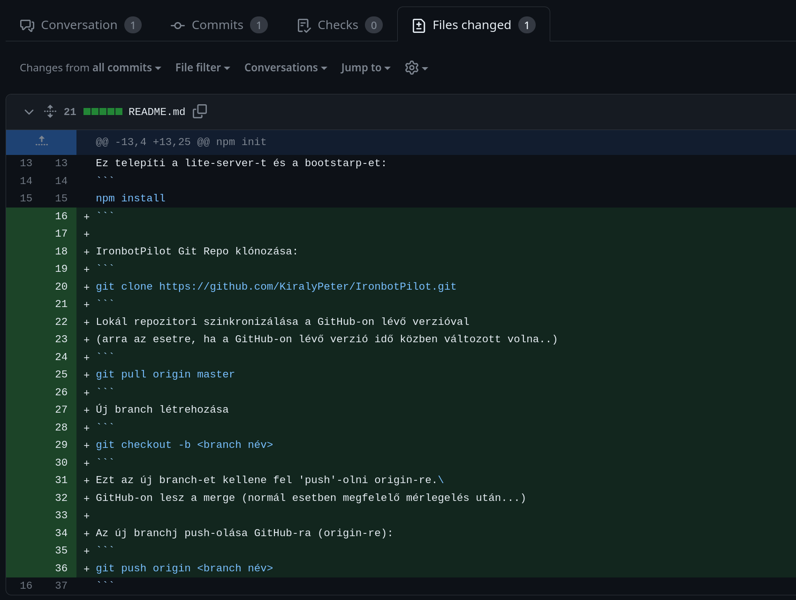

# IronbotPilot

A Pilot Projekt célja, hogy egy mintát adjon és "kézzel fogható" legyen egy elképzelés. Jelen állapotban csak egy "mockup", nem működő felületi elemekkel.

A példában a fő hangsúly a CSS GRID technológián van.\
[Mozilla - Introduction to CSS Grid Layout](https://mozilladevelopers.github.io/playground/css-grid/)

Inicializálás 'git clone' után:
```
npm init
```

Ez telepíti a lite-server-t és a bootstarp-et:
```
npm install 
```
Egyelőre ezt csinálja a jelenlegi verzió (az elemek nem akítvak):



# IronbotPilot Git Repo klónozása: 
```
git clone https://github.com/KiralyPeter/IronbotPilot.git
```

[Youtube példa link](https://youtu.be/MnUd31TvBoU)

Lokál repozitori szinkronizálása a GitHub-on lévő verzióval 
(arra az esetre, ha a GitHub-on lévő verzió idő közben változott volna..)
```
git pull origin master
```
Új branch létrehozása
```
git checkout -b <branch név>
```
Ezt az új branch-et kellene fel 'push'-olni origin-re.\
GitHub-on lesz a merge (normál esetben megfelelő mérlegelés után...)

Az új branchj push-olása GitHub-ra (origin-re):
```
git push origin <branch név>
```

GitHib-on megjelenik a "Compare & pull request"



Itt lehet átnézni a push-ban adott comment-et és további commentet lehet hagyni a "befogadó" által.

Illetve el lehet indítani a Pull request-et, aminek hatására a projektben részt vevők számára értesítés megy (? nem tudom egyedül tesztelni.)



Ha nincs konfliktus (amit a Git detektált volna), akkor be lehet merge-elni a brach-et a master-ba:



Át lehet nézni a módosításokat:



Visszacsekkolni a master-ra:
```
git checkout master
```
Utána ismét le kell frissíteniaz origin-en lévő master-t lokálba:
```
git pull origin master
```